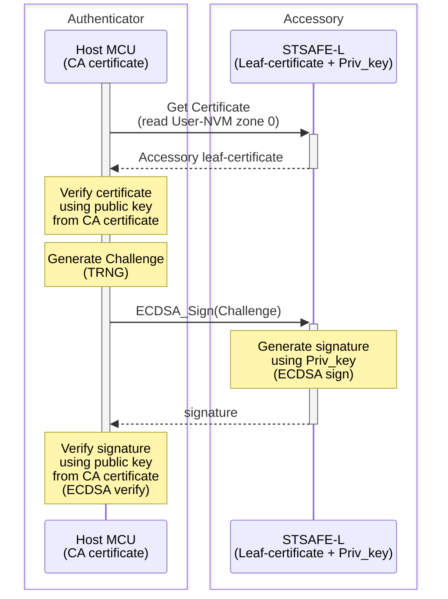
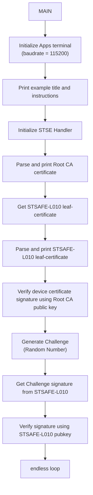
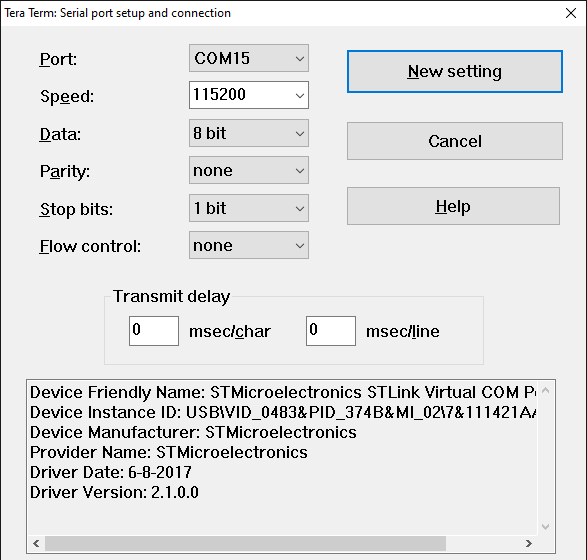

# STSAFE-L010 Accessory authentication

This project illustrates how to use the STSAFE-L010 Secure Element and STMicroelectronics Secure Element Library to perform device/accessory authentication.
When loaded on the target MCU platform , the project performes an STSAFE-L010 authentication . This authentication scheme is typicaly used in accessories authentication use cases.

The example applicative flowchart is illustrated below :

STSELib API used in the example are the following :

- stse_init
- stse_certificate_parse
- stse_certificate_print_parsed_cert
- stse_certificate_get_key_type
- stse_certificate_verify_signature
- stse_certificate_is_parent
- stse_ecc_generate_signature

## Hardware and Software Prerequisites

- [NUCLEO-L452RE - STM32L452RE evaluation board](https://www.st.com/en/evaluation-tools/nucleo-l452re.html)

- [X-NUCLEO-ESE02A1 - STSAFE-L010 Secure element expansion board](https://www.st.com/en/ecosystems/x-nucleo-ese02a1.html)

- [STM32CubeIDE - Integrated Development Environment for STM32](https://www.st.com/en/development-tools/stm32cubeide.html)

- Serial terminal PC software  (i.e. Teraterm)

## Getting started with the project

- Connect the [X-NUCLEO-ESE02A1](https://www.st.com/en/ecosystems/x-nucleo-ese02a1.html) expansion board on the top of the [NUCLEO-L452RE](https://www.st.com/en/evaluation-tools/nucleo-l452re.html) evaluation board.

- Connect the board to the development computer and Open and configure a terminal software as follow (i.e. Teraterm).

- Open the STM32CubeIDE projects located in Application/STM32CubeIDE

- Build the project by clicking the “**Build the active configurations of selected projects\ **” button and verify that no error is reported by the GCC compiler/Linker.

- Launch a debug session then wait the debugger to stop on the first main routine instruction and press Start button to execute the main routine.

> [!NOTE]
> - Power configuation Jumper must be set to 3V3-VCC.
> - The COM port can differ from board to board. Please refer to windows device manager.

<b>Result</b> :

This project reports execution log through the on-board STLINK CDC bridge.
These logs can be analyzed on development computer using a serial terminal application (i.e.: Teraterm).
As example below.

<pre>
----------------------------------------------------------------------------------------------------------------
-                          STSAFE-L010 Multi-Steps Device Authentication Example                               -
----------------------------------------------------------------------------------------------------------------
- This example illustrates STSAFE-L010 device authentication process using Multi-Step approach.                -
- it can be taken as reference for building distant server authentication use cases.                           -
----------------------------------------------------------------------------------------------------------------
 - Initialize target STSAFE-L010

## CA self-signed certificate :

         x509 Version: 3
        SerialNumber: 01
         Issuer:
                 CountryName: NL
                 OrganizationalName: STMicroelectronics nv
                 CommonName: STM_STSAFE-L_CA0001
         Subject:
                 CountryName: NL
                 OrganizationalName: STMicroelectronics nv
                 CommonName: STM_STSAFE-L_CA0001
         Validity:
                 Not Before: 2024-06-07 00:00:00
                 Not After:  2054-06-07 00:00:00
         SignatureAlgorithm: eddsa-with-SHA256
         tbsSignature: eddsa-with-SHA256
         EllipticCurve: ed25519
         Cert PubKey (Compressed):
                 X: 8447F2C098BE15F605C698D5FAC57B560F1CCF1F379FE988AA2FEAA293B5DED1
         Cert Signature:
                 r: 2931A86FED6FD7548A032072845D778797E2364B5265EAC1BF7B393605755B5D
                 s :7619FD329CFD909317F953B4B821DF9CE20DA7CD745B9EF1ABF7949F4AB0FB05
         List of Extensions:
                 BasicConstraints: CA certificate.
                 KeyUsage: keyCertSign

## Target STSAFE-L010 certificate :

         x509 Version: 3
        SerialNumber: 400000000082940113
         Issuer:
                 CountryName: NL
                 OrganizationalName: STMicroelectronics nv
                 CommonName: STM_STSAFE-L_CA0001
         Subject:
                 CountryName: IT
                 OrganizationalName: STMicroelectronics nv
                 CommonName: STSAFE-L010-GEN-400000000082940113
         Validity:
                 Not Before: 2025-04-04 06:28:13
                 Not After:  2055-04-04 06:28:13
         SignatureAlgorithm: eddsa-with-SHA256
         tbsSignature: eddsa-with-SHA256
         EllipticCurve: ed25519
         Cert PubKey (Compressed):
                 X: CEFA2831B54811C7B3E8E04139EC94B14CE361D7A216C4A63D5C9F823C1651D8
         Cert Signature:
                 r: 811E9FE0217B20A71B17EB9AAD8FFFF37E44DD6899BBF6B5D58901FD620DDE1D
                 s :BA885B99B748715443E2A367D6CE658BABA5165DCCC03C557835C2198D27070C
         List of Extensions:

## Device Certificate Verified

## Host random challenge :

  0x45 0x68 0xB2 0xC2 0x3A 0xC0 0xF1 0x99 0x9E 0x6A 0x59 0x09 0x23 0xC2 0x5B 0xEF

## Device signature over Host challenge:
  0xE9 0x13 0xA3 0x1F 0x1F 0xCF 0xE5 0xF0 0xA7 0x7B 0xF9 0xFF 0xE6 0xDF 0x35 0x9B
  0x9F 0x0D 0xB9 0x51 0x11 0x63 0xD5 0x63 0x30 0xB7 0xE1 0x20 0xE4 0xBC 0xF7 0x57
  0x4F 0x39 0x31 0xAC 0x3E 0xB3 0x26 0x59 0xF3 0xD7 0x0D 0x5C 0xD2 0x9C 0xC9 0x59
  0x0E 0x5F 0x45 0x76 0xB3 0x06 0xB3 0xDC 0xD0 0x19 0x32 0x18 0xD0 0x1B 0x5A 0x08

# ## Device Authenticated (Challenge signature verified successfully)
</pre>

 ## How to adapt the exemple

 Each STSE handler contains SE's informations mandatory by the STSELib to manage correctly targeted API and services.
-	device_type : STSAFE-A100/ STSAFE-A110/ STSAFE-A120
-	pPersoInfo  : pointer to a specific device perso configuration
-	pActive_host_session : active host session managed by the open session API set
-	pActive_other_session : other session managed by the open session API set.
-	Io : communication bus description like I2C device address , I2C speed
